# Selene

<div align="center">
  
</div>

> 🎬 **Selene** 是以 [MoonTV](https://github.com/MoonTechLab/LunaTV) v100 版本 / [Helios](https://github.com/MoonTechLab/Helios) 为后端的客户端，在保持原有使用体验的基础上持续完善移动端和桌面端功能。项目基于 **Flutter** 构建，支持 Android、iOS、macOS 和 Windows。

<div align="center">


</div>

<details>
  <summary>点击查看移动端截图</summary>
  
  
  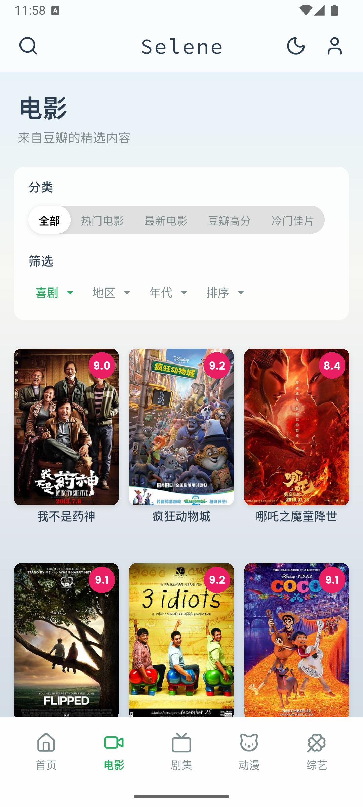
  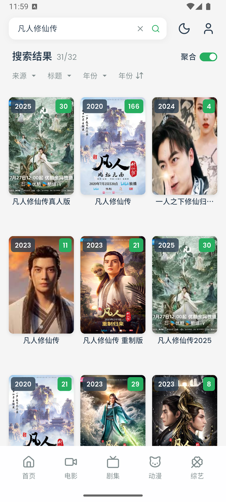
  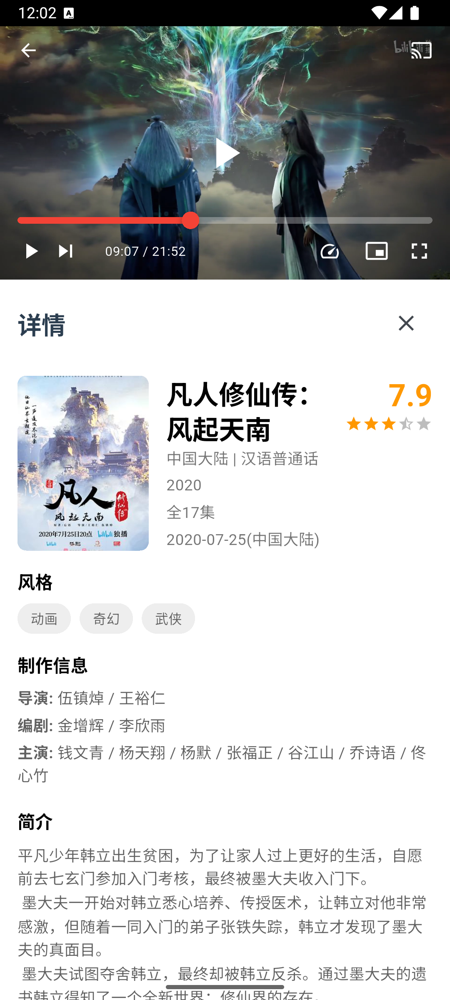
  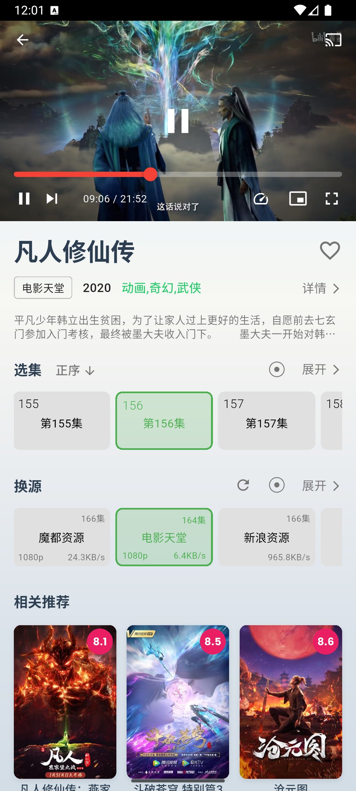
  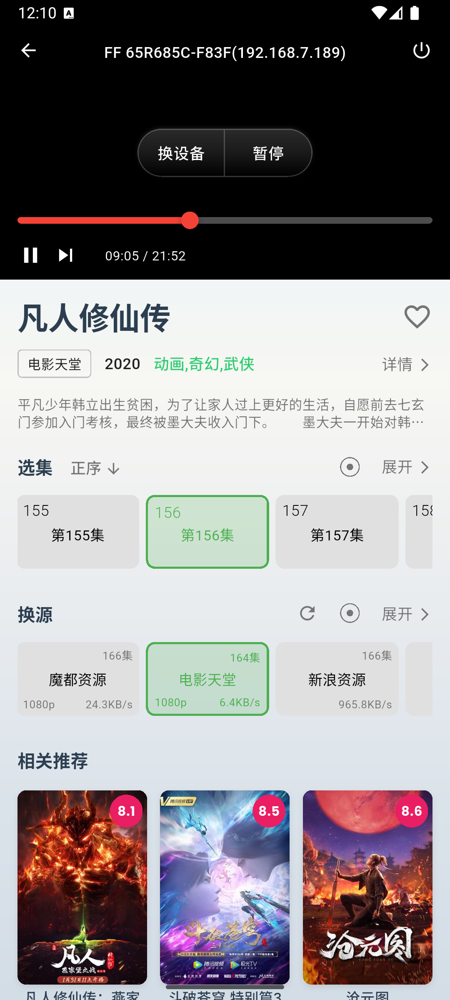
  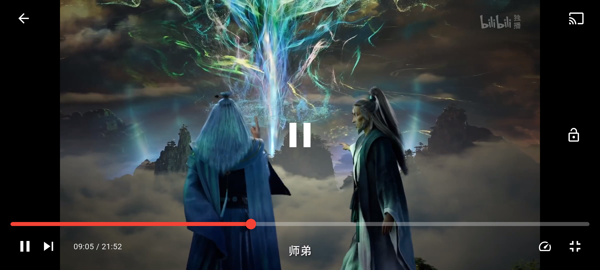
</details>

<details>
  <summary>点击查看 PC 端 / 宽屏设备截图</summary>
  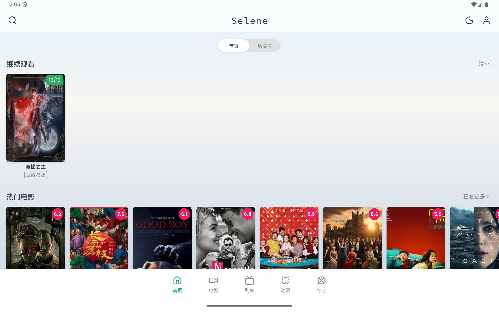
  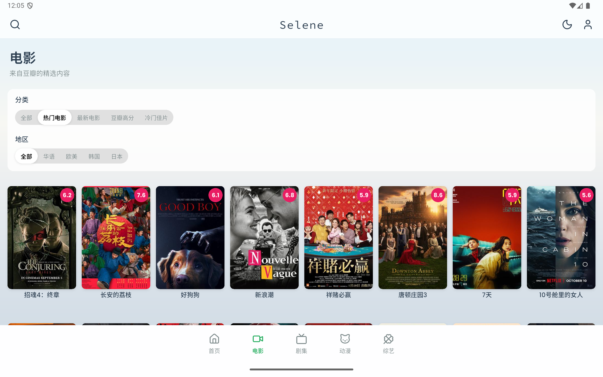
  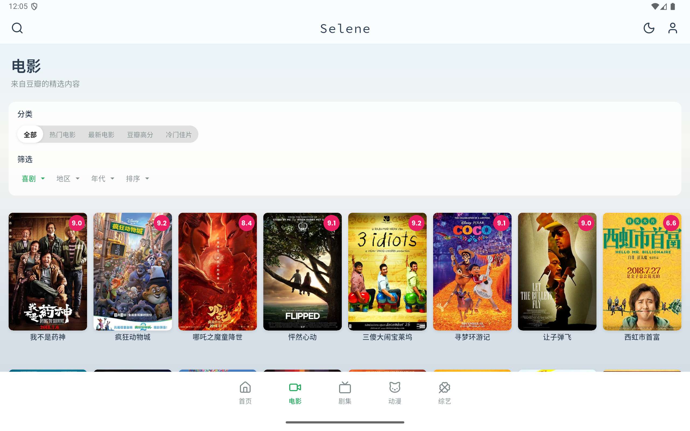
  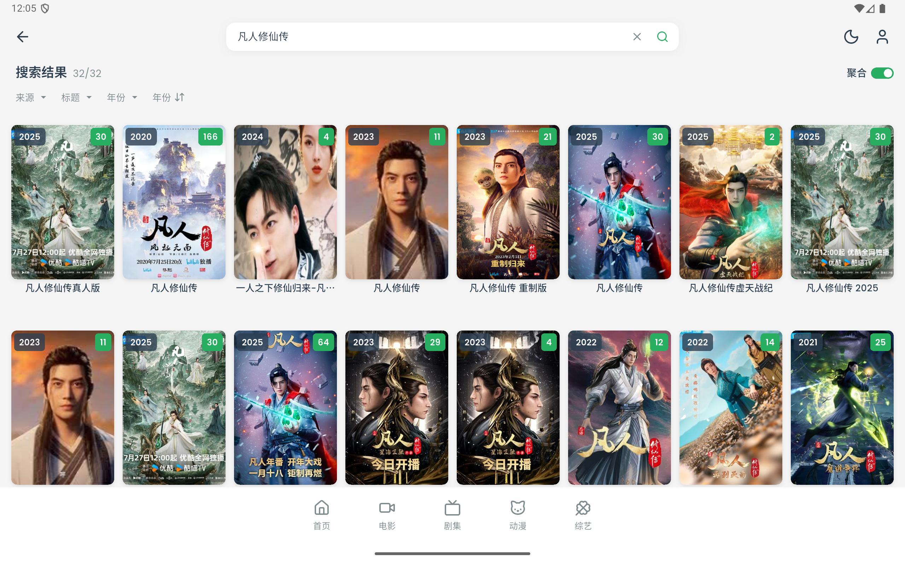
  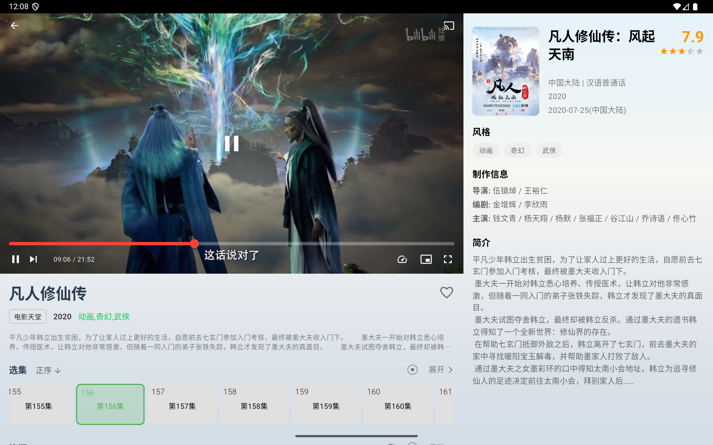
  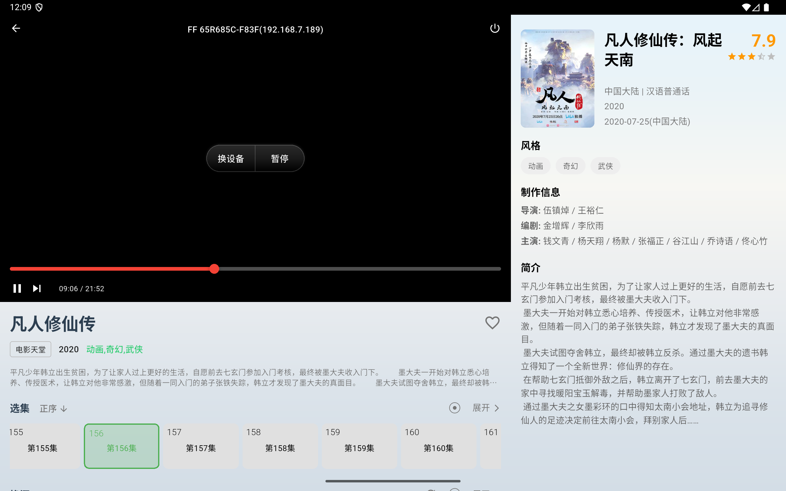
</details>

本仓库是基于 [MoonTechLab/Selene-Source](https://github.com/MoonTechLab/Selene-Source) 持续维护的独立版本，历史发布仓库见 [MoonTechLab/Selene](https://github.com/MoonTechLab/Selene)，感谢原作者与所有贡献者。

### 请不要在 B站、小红书、微信公众号、抖音、今日头条或其他中国大陆社交平台发布视频或文章宣传本项目，不授权任何“科技周刊/月刊”类项目或站点收录本项目。

---

## 📦 下载

Android APK（已签名）、Windows x64 便携版、macOS Universal DMG 和校验文件可从 [GitHub Releases](https://github.com/coledaul/selene/releases) 下载。iOS 可按项目文档从源码构建。

macOS App 如果无法打开，可执行：

```bash
xattr -dr com.apple.quarantine "/Applications/Selene.app"
```

## ✨ 功能特性

### 🎯 核心功能

- **多源聚合搜索** - 支持多个视频源的聚合搜索，快速找到想看的内容
- **智能播放记录** - 自动记录播放进度，支持断点续播
- **个人收藏夹** - 收藏喜欢的影视作品，方便随时观看
- **多类型内容** - 支持电影、电视剧、动漫、综艺和直播
- **本地订阅模式** - 无需 MoonTV 服务端即可使用订阅中的搜索源和直播源
- **视频下载** - 支持非 DRM 点播资源下载、任务恢复、下载管理和离线播放
- **DLNA 投屏** - 支持发现局域网投屏设备并同步播放进度

### 🎨 用户体验

- **现代化 UI** - 基于 Material Design 3 的现代化界面设计
- **深色模式** - 支持深色与浅色主题切换
- **响应式布局** - 针对手机、平板和桌面宽屏设备适配导航与内容布局
- **搜索建议** - 支持实时搜索建议、多源进度和失败状态提示

### 🔧 技术特性

- **跨平台播放** - 基于 `media_kit` 和 `media_kit_video` 统一移动端与桌面端播放能力
- **视频下载** - 使用 FFmpegKit 探测 HLS 或普通视频并重封装为 MKV
- **分层架构** - View、ViewModel、Repository 与 Service 职责分离
- **统一数据入口** - 服务端模式和本地模式复用 Repository 接口
- **网络与缓存** - 统一处理 HTTP、SSE、鉴权、图片缓存和业务数据缓存

## 📱 支持平台

- **Android** - 最低支持 Android 7.0（API 24）
- **iOS** - 最低支持 iOS 14.0
- **macOS** - 最低支持 macOS 11.0（Big Sur）
- **Windows** - 最低支持 Windows 10

## 📖 使用说明

### 首次使用

1. 启动应用后，系统会自动检查登录状态
2. 服务端模式需要填写 MoonTV 服务端地址、用户名和密码
3. 登录页连续点击 Logo 10 次可切换到本地订阅模式
4. 登录或导入订阅成功后进入主界面

### 主要功能

- **首页** - 查看热门内容、继续观看和个人收藏
- **搜索** - 多源聚合搜索并显示实时结果和搜索进度
- **分类浏览** - 按电影、电视剧、动漫和综艺分类浏览
- **直播** - 浏览直播源、频道和节目单
- **播放器** - 支持播放源优选、续播、DLNA 投屏和播放控制
- **下载管理** - 创建、取消、重试、导出和删除下载任务

## 🏗️ 技术架构

### 核心技术栈

- **Flutter 3.44+** - 跨平台 UI 框架
- **Dart 3.12+** - 编程语言
- **MVVM** - View、ViewModel、Repository 与 Service 分层
- **Provider** - 应用组合与主题监听
- **Dio** - HTTP 与 SSE 网络访问
- **Media Kit** - 跨平台视频播放
- **FFmpegKit** - 视频探测与下载重封装
- **GoRouter** - 强类型路由
- **Freezed** - 不可变状态和领域模型
- **Cached Network Image** - 图片缓存
- **DLNA Dart** - 投屏功能

```text
View -> ViewModel -> Repository -> Service -> 外部系统
```

## 📚 项目文档

- [项目概览与目录结构](./docs/guide/overview.md)
- [配置说明](./docs/guide/configuration.md)
- [开发与构建](./docs/guide/development.md)
- [发布指南](./docs/guide/release.md)

## ⚠️ 免责声明

**重要提醒：**

1. **仅供学习交流** - 本项目仅用于技术学习和交流目的，不提供任何商业服务。

2. **内容来源** - 本应用聚合的内容来源于第三方平台，我们不对内容的合法性、准确性、完整性或可用性承担任何责任。

3. **版权声明** - 所有影视内容的版权归原作者和版权方所有，请用户自觉遵守相关法律法规，支持正版。

4. **使用风险** - 用户使用本应用所产生的任何直接或间接损失，开发者不承担任何责任。

5. **合规使用** - 请用户在使用过程中遵守当地法律法规，不得用于任何违法用途。

6. **数据安全** - 虽然我们重视用户隐私，但请用户自行承担数据安全风险。

**使用本应用即表示您已阅读并同意上述免责声明。**

## 🙏 致谢

- [MoonTV](https://github.com/MoonTechLab/LunaTV) - 服务端生态支持
- [Helios](https://github.com/MoonTechLab/Helios) - Selene API 历史后端
- [Flutter](https://flutter.dev/) - 跨平台开发框架
- 原作者、所有贡献者和用户的支持

---

<div align="center">
  <p>如果这个项目对您有帮助，请给个 ⭐️ 支持一下！</p>
</div>

[](https://www.star-history.com/#coledaul/selene&Date)
